# LeetCode Card

Render your LeetCode contest rating as an animated SVG card that lives in your own repo.

<p align="center">
  
</p>

Your rating history draws itself in as a line with the peak marked, next to your badge, rating, top percentage, contest count, solved count and Easy/Medium/Hard progress bars. The preview is live data for [sagargupta1610](https://leetcode.com/u/sagargupta1610/), rendered 2026-09-25.

The card is a file in your repo, not an image served by a widget host, so there is no quota to run out and no third-party server to go down.

## Quick start

Create `.github/workflows/leetcode-card.yml`:

```yaml
name: LeetCode card

on:
  schedule:
    - cron: "30 6 * * *" # every day at 06:30 UTC
  workflow_dispatch:

permissions:
  contents: write

jobs:
  card:
    runs-on: ubuntu-latest
    steps:
      - uses: actions/checkout@v6

      - uses: Sagargupta16/leetcode-card-action@v1
        with:
          username: your-leetcode-username

      - name: Commit the card if it changed
        run: |
          git config user.name "github-actions[bot]"
          git config user.email "41898282+github-actions[bot]@users.noreply.github.com"
          git add assets/leetcode.svg
          if ! git diff --cached --quiet; then
            git commit -m "chore: update LeetCode card"
            git push
          fi
```

Run it once from the Actions tab to create the card. After that it refreshes every day, and commits only when the card changed.

## Embed

In your README:

```html
<a href="https://leetcode.com/u/your-leetcode-username/">
  
</a>
```

Or plain Markdown: ``

## Inputs

| Input | Required | Default | Description |
|-------|----------|---------|-------------|
| `username` | Yes | - | Your LeetCode username, as in `leetcode.com/u/<username>` |
| `output` | No | `assets/leetcode.svg` | Where to write the SVG, relative to the repository root |
| `accent` | No | `#f59e0b` | Accent color as `#rgb` or `#rrggbb`: the rating line, the badge line and the heading |
| `title` | No | `LEETCODE CONTEST RATING \| {contests} CONTESTS` | Card heading. `{contests}` becomes the number of rated contests you attended |

If you change `output`, change the path in the commit step to match.

## Outputs

| Output | Description |
|--------|-------------|
| `rating` | Current contest rating, rounded. Empty if you have no rated contest yet |
| `badge` | Contest badge, such as `Knight` or `Guardian`. Empty if you have none |
| `solved` | Number of problems solved |
| `contests` | Number of rated contests attended |

All four are empty on a run where the fetch failed and the old card was kept.

## How it works

1. Sends one GraphQL query to `https://leetcode.com/graphql`, the public endpoint LeetCode's own profile pages read from. No token, no login, no secrets.
2. Builds the card with the Python standard library. The SVG is self-contained: no scripts, no external fonts or images, CSS and SMIL animation only, so it renders inside GitHub's `` sandbox.
3. Writes it to `output`. The same numbers always produce the same bytes, so an unchanged profile leaves nothing to commit.
4. If LeetCode fails (network error, rate limit, an error or a changed shape in the response, a username that does not exist), the existing card is kept, the run logs a warning and the step succeeds. With no card to keep yet, the step fails with the reason.

The card adapts to your profile:

- **Two or more rated contests:** the rating chart, with the peak ringed and labeled.
- **Fewer than two:** a shorter card without the chart, since a line needs two points. The badge line reads "No contests yet" when there are none.
- **No badge:** the badge line shows your rating instead.

## Limits

- LeetCode's GraphQL API is unofficial and undocumented. It can change shape, rate-limit or block runners without notice. When it does, your last card stays up and the run warns.
- leetcode.com accounts only. leetcode.cn is a separate site with its own API.
- The numbers are as fresh as your schedule: daily with the Quick start workflow.
- The card is 840 px wide and scales down with the page, so on a phone its smallest labels get small.
- Fonts come from the viewer's system (JetBrains Mono or Consolas, Segoe UI or Inter or the system UI font), so text renders slightly differently across operating systems.
- The action writes the file and nothing else. Committing it is up to your workflow, as in the Quick start.

## License

MIT. See [LICENSE](LICENSE).
